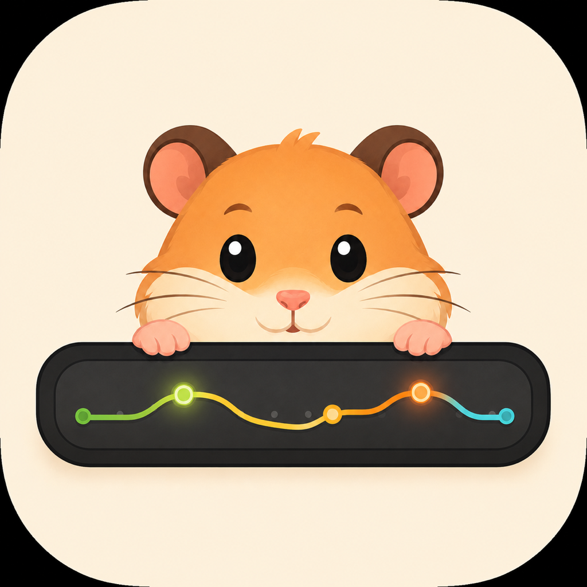

<p align="center">
  
</p>

<h1 align="center">CC Trace Mobile</h1>

<p align="center">An iOS / Android app: check the remaining quota and reset times of Codex and Claude Code anytime,<br>without going back to your computer.</p>

<p align="center">
  
  
  
  <a href="https://github.com/nanvon/cc-trace-mobile/releases/latest"></a>
  
</p>

<p align="center">
  <a href="https://github.com/nanvon/cc-trace-mobile/releases/latest">Download</a> ·
  <a href="#-installation">Install</a> ·
  <a href="#-building-from-source">Build from source</a> ·
  <a href="#-related-projects">Related projects</a> ·
  <a href="https://github.com/nanvon/cc-trace-mobile/issues">Feedback</a> ·
  <a href="README.md">简体中文</a>
</p>

<!-- Header screenshot placeholder: add light/dark home-screen shots under docs/images/ and replace this comment:
<p align="center">
  
  
</p>
-->

## ✨ Features

- **Quota overview** — remaining 5-hour / weekly window quota and reset countdowns for Codex and Claude Code; progress bars color-coded in four tiers by remaining quota; Codex bonus reset counts and Claude Code model-specific quotas get their own cards; pull to refresh
- **Sign-in** — opens the system browser to the provider's official login page, standard OAuth + PKCE; no passwords typed inside the app; you can sign in to just one of the two services
- **Preferences** — account sign-in/out, appearance (system / light / dark), refresh interval (15 / 30 / 60 minutes, default 30)
- **Restrained refreshing** — auto-refresh runs only in the foreground, no notifications, no background polling; manual refresh is throttled to once a minute, with graduated backoff when rate-limited; stale data is labeled with its age instead of posing as fresh

### 📸 Screenshots

<!-- Screenshot placeholder: add the following assets under docs/images/ (portrait phone shots) and replace this table.
     1. home-light.png / home-dark.png  quota home (both services + progress bars + countdowns)
     2. settings.png                    settings page (account / appearance / refresh interval)
-->

|            Quota overview              |             Preferences              |
| :------------------------------------: | :----------------------------------: |
| _pending `docs/images/home-light.png`_ | _pending `docs/images/settings.png`_ |

## 📦 Installation

🍎 Requires iOS 13 or later, or an arm64 Android device; you need a paid Codex or Claude Code subscription (at least one).

**Android**: download `CC-Trace-Mobile_<version>_Android-arm64.apk` from [Releases](https://github.com/nanvon/cc-trace-mobile/releases/latest) and install it directly. The APK is properly signed and ships a same-named `.sha256` for verification; the first install requires allowing "install from unknown sources".

**iOS**: no App Store release, no TestFlight, no IPA — this project does not buy an Apple Developer account, so the only path is self-signing with a **free Apple ID** (re-sign every 7 days). You need a Mac with Xcode installed:

```bash
flutter pub get
flutter run --release   # connect your device and sign with your own Apple ID
```

> [!NOTE]
> The iOS self-sign-to-device path has not been fully verified; what CI continuously verifies is that `flutter build ios --release --no-codesign` compiles. Android has passed end-to-end verification on a real device (sign-in plus live quota calls).

## 🔒 Data & Security

CC Trace Mobile is a small open-source tool built for personal use, with **no server of its own** — no backend, no telemetry, no crash reporting:

- Quota data is requested only from the official Codex and Claude Code endpoints; credentials are never sent to any third party
- Credentials live in the iOS Keychain / Android Keystore; the quota cache stays on-device
- No reading or uploading of conversations or code; tokens never enter logs, caches, or any debug output
- Signing out deletes both the locally stored credentials and the quota cache

> [!TIP]
> Sign-in and quota queries use the client ID of the official CLIs and non-public usage endpoints, which may break whenever a provider tightens policy; if that concerns you, review the code and [build from source](#-building-from-source).

## 🔧 Building from Source

Stack: Flutter / Dart. Only four runtime dependencies: `http`, `crypto`, `flutter_secure_storage`, `shared_preferences`.

**Daily development**: `flutter pub get --enforce-lockfile`, then `flutter run`.

**Release packaging**:

```bash
flutter analyze && flutter test
flutter build apk --release --target-platform android-arm64   # Android
flutter build ios --release --no-codesign                     # iOS (unsigned build)
```

Pushing a `v*` tag matching the `pubspec.yaml` version makes CI build a release APK with the official signing key and create a public Release; see [GitHub 自动构建与发布](docs/GitHub自动构建与发布.md).

## 🔗 Related Projects

Three apps by the same author, sharing the same quota semantics and visual language:

|                                                    |                                          |
| -------------------------------------------------- | ---------------------------------------- |
| [**cc-bar**](https://github.com/nanvon/cc-bar)     | Native macOS menu bar version (SwiftUI)  |
| [**CC Trace**](https://github.com/nanvon/cc-trace) | Desktop · macOS menu bar / Windows tray  |
| **CC Trace Mobile** (this repository)              | Mobile · iOS / Android                   |

The three apps are independent; data and settings are not shared.

## 📢 Disclaimer

This project is not an official product of OpenAI or Anthropic, is not affiliated with either company, and is not endorsed or supported by them. Codex, Claude, and related names belong to their respective owners.

## 📄 License

[MIT](LICENSE)
